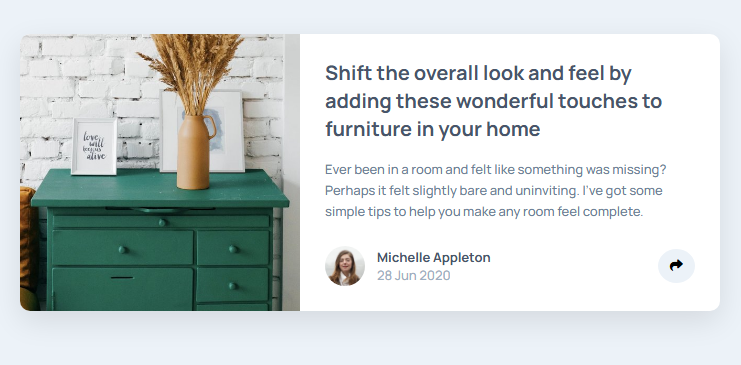

# Frontend Mentor - Article preview component

This is a solution to the [Article preview component challenge on Frontend Mentor](https://www.frontendmentor.io/challenges/article-preview-component-dYBN_pYFT). Frontend Mentor challenges help you improve your coding skills by building realistic projects. 

## Table of contents
- [The challenge](#the-challenge)
- [Screenshot](#screenshot)
- [Built with](#built-with)
- [Author](#author)

### The challenge

Users should be able to:

- View the optimal layout for the component depending on their device's screen size
- See the social media share links when they click the share icon

### Screenshot

### Built with

- Semantic HTML5 markup
- CSS custom properties
- Flexbox
- CSS Grid
- Mobile-first workflow
- [Styled Components](https://fontawesome.com/) - For styles

## Author

- Website - [Toni Thomas](https://diybookoflife.github.io/react-portfolio/)
- Frontend Mentor - [DiyBookOfLife](https://www.frontendmentor.io/profile/DiyBookOfLife)
- LinkedIn - [tonithomas2025](https://www.linkedin.com/in/tonithomas2025/)
